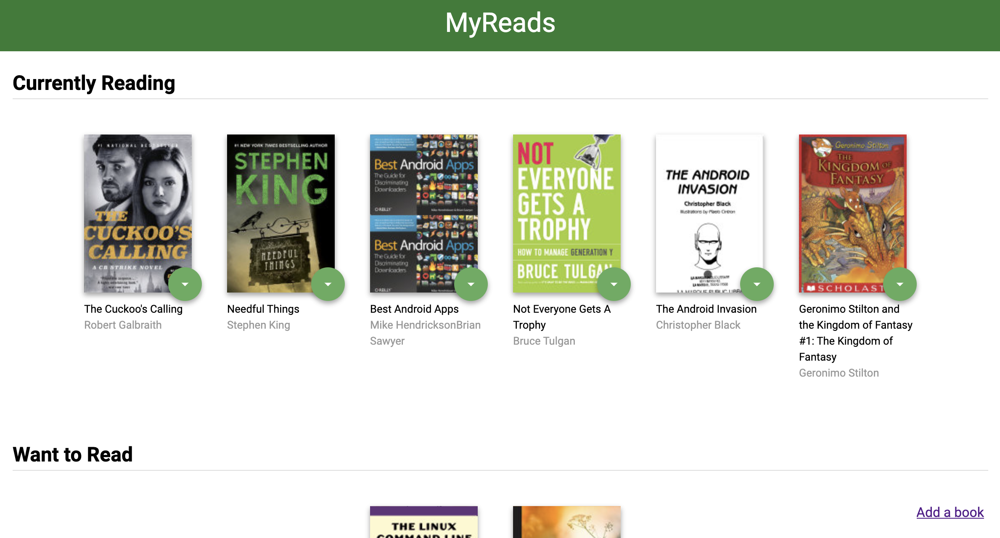

This is an application created with ReactJS. This projects demonstrates the understanding of props, states, Components, JSX, AJAX, and JavaScript(ECMAScript) 6.

Here is how you can load the application onto your local machine:

To start the react app, following these simple two steps:

1. Install dependencies: npm install
2. npm start

This will start the app in your default browser at: localhost:3000
